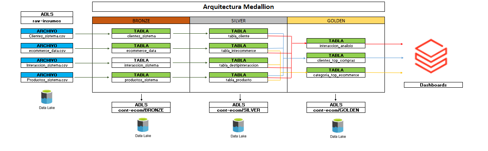
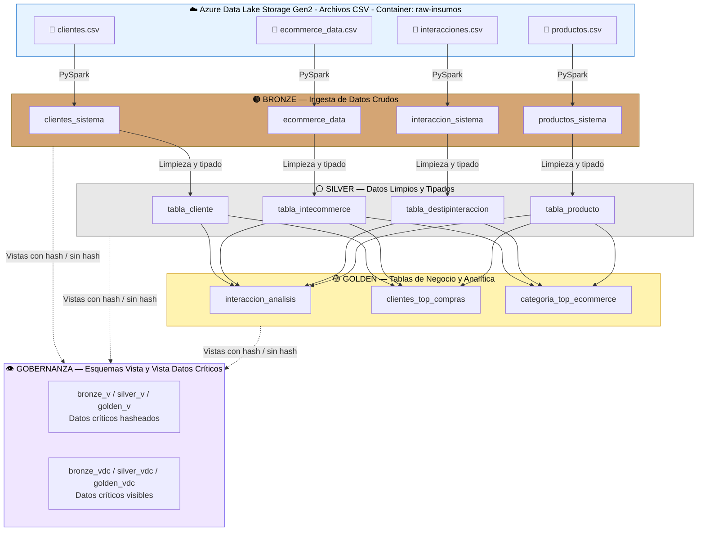
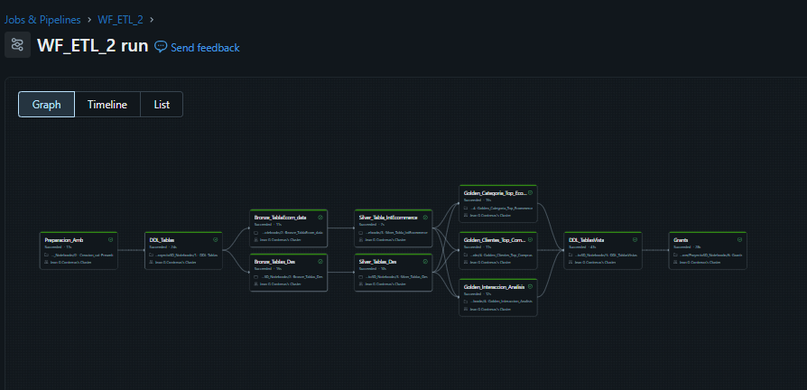

# Documentación Técnica: Sistema de Procesamiento y Gobernanza de Datos para una plataforma de comercio electrónico (E-commerce)

## 📋 Resumen del Proyecto
Este proyecto realiza una ejecución de un modelo de arquitectura Medallion del cual extrae, transforma y carga datos hacia tablas delta para el análisis y tratamiento de datos en nube para la toma decisiones en una empresa.\
**Propósito:** El sistema está diseñado para el **tratamiento y análisis de interacciones de clientes en el ámbito de E-commerce** dentro de su interfaz web (interacciones en la pagina web, navegación, compras, preferencia de los productos y categorias, clientes), con el fin de optimizar la experiencia de usuario en la empresa.

---

## 🛠️ Stack Tecnológico
* **Entorno:** Microsoft Azure Databricks
* **Lenguaje Principal:** Python (PySpark), SQL
* **Almacenamiento:** Delta Lake
* **Seguridad:** Microsoft Entra ID (Gestión de Identidades y Grupos)

---

## 🏗️ Estructura de Capas (Medallion Architecture)

El proyecto se divide en tres capas lógicas para garantizar la calidad del dato:

1.  **Bronze (Ingesta):** Ingesta de los datos crudos provenientes de fuentes externas (CSV).
2.  **Silver (Limpieza):** Datos filtrados, tipados y con esquemas definidos.
3.  **Golden (Negocio):** Tablas finales listas para consumo de BI y analítica.

### Diagrama

**Flujo de datos:**
* **ADLS → Bronze:** Ingesta de archivos CSV crudos mediante PySpark.
* **Bronze → Silver:** Limpieza, tipado de columnas (VARCHAR, DECIMAL, DATE) y estandarización de nombres en español.
* **Silver → Golden:** Cruces entre tablas dimensionales para generar KPIs y métricas de negocio.
* **Todas las capas → Gobernanza:** Creación de esquemas vista con datos hasheados (`_v`) y sin hashear (`_vdc`) para control de acceso.

## 📑 Diccionario de Tablas y Columnas

**Catálogo:** `catalogo_desa_intecommerce`

### 🟤 Capa Bronze (Ingesta de Datos Crudos)

#### Tabla: `bronze.clientes_sistema`
Tabla que tiene como registros a los clientes que se encuentran interactuando en la plataforma E-commerce (Datos crudos)\
*Ubicación:* `catalogo_desa_intecommerce.bronze.clientes_sistema` |

| Columna | Tipo | Descripción |
| :--- | :--- | :--- |
| `User_id` | `STRING` | Identificador único del cliente/usuario. |
| `Last_Name` | `STRING` | Apellido del cliente. |
| `Name` | `STRING` | Nombre del cliente. |
| `Age` | `INT` | Edad del cliente. |
| `Cell_number` | `STRING` | Número de celular del cliente. |
| `Sign_date` | `DATE` | Fecha de inscripción en la página web. |
| `Fecha_proceso` | `TIMESTAMP` | Fecha y hora del proceso de ingesta. |

---

#### Tabla: `bronze.ecommerce_data`
Tabla que tiene como registros a las interacciones que realizan los clientes en la plataforma E-commerce con detalles (fecha, hora, lugar, etc) (Datos crudos)\
*Ubicación:* `catalogo_desa_intecommerce.bronze.ecommerce_data` |

| Columna | Tipo | Descripción |
| :--- | :--- | :--- |
| `Interaction_id_system` | `VARCHAR(6)` | Identificador único de la interacción en el sistema. |
| `Interaction_date` | `STRING` | Fecha de la interacción. |
| `User_id_system` | `STRING` | Identificador del usuario en el sistema. |
| `Product_id` | `STRING` | Código del producto en el sistema. |
| `TypeInt_id` | `VARCHAR(30)` | Código del tipo de interacción. |
| `Event` | `VARCHAR(256)` | Descripción del evento de interacción. |
| `Location` | `STRING` | Ubicación geográfica de la interacción. |
| `Quantity` | `STRING` | Cantidad de productos en la interacción (Solo compra). |
| `Product_rating` | `DECIMAL(10,1)` | Puntuación/calificación del producto. |
| `Fecha_proceso` | `TIMESTAMP` | Fecha y hora del proceso de ingesta. |

---

#### Tabla: `bronze.interaccion_sistema`
Tabla que tiene a los tipos de interacciones que se pueden realizar en la pagina web (Ej. Compra, Vista, etc) (Datos crudos)\
*Ubicación:* `catalogo_desa_intecommerce.bronze.interaccion_sistema` |

| Columna | Tipo | Descripción |
| :--- | :--- | :--- |
| `TypeInt_id` | `STRING` | Código identificador del tipo de interacción. |
| `Interaction_name` | `STRING` | Nombre del tipo de interacción (en inglés). |
| `DestipoInt_Spanish` | `STRING` | Descripción del tipo de interacción (en español). |
| `Registration_system_date` | `STRING` | Fecha de registro en el sistema. |
| `Fecha_proceso` | `TIMESTAMP` | Fecha y hora del proceso de ingesta. |

---

#### Tabla: `bronze.productos_sistema`
Tabla que tiene a los productos y sus respectivas categorias registradas en la pagina web (Datos crudos)\
*Ubicación:* `catalogo_desa_intecommerce.bronze.productos_sistema` |

| Columna | Tipo | Descripción |
| :--- | :--- | :--- |
| `Product_id` | `STRING` | Identificador único del producto. |
| `Producto_Name` | `STRING` | Nombre del producto. |
| `Category` | `STRING` | Categoría a la que pertenece el producto. |
| `Price` | `DOUBLE` | Precio del producto. |
| `Fecha_proceso` | `TIMESTAMP` | Fecha y hora del proceso de ingesta. |

---

### ⚪ Capa Silver (Datos Limpios y Tipados)

#### Tabla: `silver.tabla_cliente`
Tabla que tiene como registro a los clientes que se encuentran interactuando en la plataforma E-commerce\
*Ubicación:* `catalogo_desa_intecommerce.silver.tabla_cliente` |

| Columna | Tipo | Descripción |
| :--- | :--- | :--- |
| `ID_Cliente` | `VARCHAR(30)` | Identificador único del cliente. |
| `Apellido` | `VARCHAR(256)` | Apellido del cliente. |
| `Nombre` | `VARCHAR(256)` | Nombre del cliente. |
| `Edad` | `INT` | Edad del cliente. |
| `Numero_Celular` | `VARCHAR(90)` | Número de celular del cliente. |
| `Fecha_inscripcion_PagWeb` | `DATE` | Fecha de inscripción en la página web. |
| `Fecha_proceso` | `TIMESTAMP` | Fecha y hora del proceso de transformación. |

---

#### Tabla: `silver.tabla_destipinteraccion`
Tabla que tiene a los tipos de interacciones que se pueden realizar en la pagina web (Ej. Compra, Vista, etc)\
*Ubicación:* `catalogo_desa_intecommerce.silver.tabla_destipinteraccion` |

| Columna | Tipo | Descripción |
| :--- | :--- | :--- |
| `Cod_Tipo_Interaccion` | `VARCHAR(30)` | Código del tipo de interacción. |
| `Nombre_codigo_sistema` | `VARCHAR(30)` | Nombre del código en el sistema. |
| `Descripcion_interaccion` | `VARCHAR(256)` | Descripción detallada de la interacción. |
| `Fecha_registro_sistema` | `DATE` | Fecha de registro en el sistema. |
| `Fecha_proceso` | `TIMESTAMP` | Fecha y hora del proceso de transformación. |

---

#### Tabla: `silver.tabla_intecommerce`
Tabla que tiene como registros a las interacciones que realizan los clientes en la plataforma E-commerce con los detalles (fecha, hora, lugar, etc)\
*Ubicación:* `catalogo_desa_intecommerce.silver.tabla_intecommerce` |

| Columna | Tipo | Descripción |
| :--- | :--- | :--- |
| `ID_interaccion` | `VARCHAR(6)` | Identificador único de la interacción. |
| `Fecha_Interaccion` | `STRING` | Fecha de la interacción. |
| `ID_Cliente` | `STRING` | Identificador del cliente. |
| `Cod_producto` | `STRING` | Código del producto. |
| `Cod_Tipo_Interaccion` | `VARCHAR(30)` | Código del tipo de interacción. |
| `Evento` | `VARCHAR(256)` | Descripción del evento. |
| `Locacion` | `STRING` | Ubicación geográfica. |
| `Cantidad_Producto` | `STRING` | Cantidad de productos. |
| `Puntuacion_Producto` | `DECIMAL(10,1)` | Puntuación del producto. |
| `Fecha_proceso` | `TIMESTAMP` | Fecha y hora del proceso de transformación. |

---

#### Tabla: `silver.tabla_producto`
Tabla que tiene a los productos y sus respectivas categorias registradas en la pagina web.\
*Ubicación:* `catalogo_desa_intecommerce.silver.tabla_producto` |

| Columna | Tipo | Descripción |
| :--- | :--- | :--- |
| `Cod_producto` | `VARCHAR(30)` | Código identificador del producto. |
| `Nombre_producto` | `VARCHAR(256)` | Nombre del producto. |
| `Categoria` | `VARCHAR(256)` | Categoría del producto. |
| `Precio` | `DECIMAL(16,2)` | Precio del producto. |
| `Fecha_proceso` | `TIMESTAMP` | Fecha y hora del proceso de transformación. |

---

### 🟡 Capa Golden (Tablas de Negocio / Analítica)

#### Tabla: `golden.categoria_top_ecommerce`
Tabla que registra la cantidad de interacciones que tiene cada categoria de producto y añade una clasificacion de categoria segun la cantidad de interacciones en la pagina web.\
*Ubicación:* `catalogo_desa_intecommerce.golden.categoria_top_ecommerce` |

| Columna | Tipo | Descripción |
| :--- | :--- | :--- |
| `Categoria` | `VARCHAR(256)` | Categoría del producto. |
| `Nombre_CodInteraccion` | `VARCHAR(30)` | Nombre del código de interacción. |
| `CantInteraccion_Categoria` | `BIGINT` | Cantidad total de interacciones por categoría. |
| `Periodo_Mes` | `STRING` | Codigo del período mensual y año. |
| `KPI_Producto_Ecommerce` | `STRING` | Indicador KPI del producto en e-commerce. |

---

#### Tabla: `golden.clientes_top_compras`
Tabla que registra las compras totales que realizaron los clientes en la pagina web, ademas, añade una categoría al cliente por la compra acumulada realizada.\
*Ubicación:* `catalogo_desa_intecommerce.golden.clientes_top_compras` | Solo ingresan los registros con interacción de compra (Purchase)

| Columna | Tipo | Descripción |
| :--- | :--- | :--- |
| `ID_Cliente` | `VARCHAR(30)` | Identificador único del cliente. |
| `Nombre_completo` | `STRING` | Nombre completo del cliente. |
| `Numero_Celular` | `VARCHAR(90)` | Número de celular del cliente. |
| `KPI_Tipo_Cliente` | `STRING` | Clasificación KPI del tipo de cliente. |
| `Precio_Compra_Total` | `DECIMAL(20,2)` | Monto total acumulado de compras del cliente. |

---

#### Tabla: `golden.interaccion_analisis`
Tabla que tiene los detalles de las interacciones que se realizaron en la pagina web con nombre de productos, clientes, interaccion, obtenidos de las tablas dimensionales.\
*Ubicación:* `catalogo_desa_intecommerce.golden.interaccion_analisis` |

| Columna | Tipo | Descripción |
| :--- | :--- | :--- |
| `ID_interaccion` | `VARCHAR(6)` | Identificador único de la interacción. |
| `Periodo_Mes` | `STRING` | Codigo del período mensual y año de la interacción. |
| `Fecha_Interaccion` | `DATE` | Fecha de la interacción. |
| `Hora_Interaccion` | `VARCHAR(6)` | Hora de la interacción. |
| `ID_Cliente` | `STRING` | Identificador del cliente. |
| `Nombre_completo` | `STRING` | Nombre completo del cliente. |
| `Numero_Celular` | `VARCHAR(90)` | Número de celular del cliente. |
| `Nombre_CodInteraccion` | `VARCHAR(30)` | Nombre del código de interacción. |
| `Descripcion_interaccion` | `VARCHAR(256)` | Descripción detallada de la interacción. |
| `Evento` | `VARCHAR(256)` | Descripción del evento. |
| `Locacion` | `STRING` | Ubicación geográfica de la interacción. |
| `Categoria` | `VARCHAR(256)` | Categoría del producto. |
| `Nombre_producto` | `VARCHAR(256)` | Nombre del producto. |
| `Cantidad_Producto` | `STRING` | Cantidad de productos comprados (Si la interacción no es compra, el valor será '-'). |
| `Puntuacion_Producto` | `DECIMAL(10,1)` | Puntuación/calificación del producto. |

---

### 👁️ Esquemas Vista (Resumen de Tablas por Esquema)

1.  **Bronze_v :** Esquema vista que hashea datos criticos (Ej. Nombre, Numero de celular, Apellido)
2.  **Silver_v :** Esquema vista que hashea datos criticos (Ej. Nombre, Numero de celular, Apellido)
3.  **Golden_v :** Esquema vista que hashea datos criticos (Ej. Nombre, Numero de celular, Apellido)
4.  **Bronze_vdc :** Esquema vista para usuarios con acceso a visualización de datos criticos (Ej. Nombre, Numero de celular, Apellido)
5.  **Silver_vdc :** Esquema vista para usuarios con acceso a visualización de datos criticos (Ej. Nombre, Numero de celular, Apellido)
6.  **Golden_vdc :** Esquema vista para usuarios con acceso a visualización de datos criticos (Ej. Nombre, Numero de celular, Apellido)

Las siguientes tablas muestran las vistas disponibles en cada esquema de gobernanza:

#### Vistas sin acceso a datos críticos: 
Por temas de seguridad, los datos criticos se encuentran hasheados en este esquema y todos los grupos y usuarios pueden acceder.

| Esquema | Tablas Disponibles |
| :--- | :--- |
| `bronze_v` | clientes_sistema, ecommerce_data, interaccion_sistema, productos_sistema |
| `silver_v` | tabla_cliente, tabla_destipinteraccion, tabla_intecommerce, tabla_producto |
| `golden_v` | categoria_top_ecommerce, clientes_top_compras, interaccion_analisis |

#### Vistas con acceso a datos críticos: 
Solo los usuarios con acceso a datos criticos pueden acceder (Ej. Data Stewards)

| Esquema | Tablas Disponibles |
| :--- | :--- |
| `bronze_vdc` | clientes_sistema |
| `silver_vdc` | tabla_cliente |
| `golden_vdc` | clientes_top_compras, interaccion_analisis |

---

## 📜 Descripción de Scripts y orden de ejecución del Workflow

Para ejecutar el pipeline completo de manera secuencial:

### 0. `Creacion_cat-Preamb.ipynb`
Script para creación del catalogo, esquemas, esquemas vistas y external location para la lectura y escritura en el container ADLS

### 1. `Grants.ipynb`
Script para creación de tablas fisicas y direccionamiento de las rutas y container en ADLS
* **Función:** Ejecuta comandos de creacion de tablas.

### 2. `Bronze_TablaEcom_data.ipynb` y `Bronze_Tablas_Des.ipynb`
Script de Python para pruebas de carga y desarrollo.
* **Función:** Realiza la ingesta de los datos en archivos CSV hacia la capa bronze.
* **Lógica:** Utiliza lenguaje de PySpark para la ingesta, estructuración e inserción de datos a las tablas.

### 3. `Silver_Tabla_IntEcommerce.ipynb` y `Silver_Tablas_Des.ipynb`
Script de Python para pruebas de carga y desarrollo.
* **Función:** Realiza la lectura de las tablas bronze, limpieza y la ingesta de los datos hacia las tablas de la capa silver. Luego, cambia los nombres estandarizados de los campos de la tabla
* **Lógica:** Utiliza lenguaje de PySpark para la estructuración e inserción de datos a las tablas.

### 4. `Golden_Categoria_Top_Ecommerce.ipynb`, `Golden_Clientes_Top_Compras.ipynb` y `Golden_Interaccion_Analisis.ipynb`
Script de Python para pruebas de carga y desarrollo.
* **Función:** Realiza cruces entre las tablas de las silver para la creacion de tablas con KPIs y mediciones que permitan visualizar resultados con el propósito de analizalos.
* **Lógica:** Utiliza lenguaje de PySpark para la ingesta, estructuración e inserción de datos a las tablas.

### 5. `DDL_TablasVistas.ipynb.ipynb`
Gestiona la gobernanza y los privilegios de los usuarios en el clúster.
* **Función:** Ejecuta comandos para la creacion de tablas en los esquemas vista y vista de datos criticos y la ingesta de los datos de todas las capas por cada esquema creado.

### 6. `Grants.ipynb`
Gestiona la gobernanza y los privilegios de los usuarios.
* **Función:** Ejecuta comandos `GRANT` y creación de grupos de usuarios.
* **Uso:** Definir quién puede leer cada capa de datos en el entorno vista (Ej. Data Engineers vs. Data Steward).

---
### 📈 Dashboards del proyecto

[https://github.com/jeancontreras150/Proy-AzureDatabricks/tree/construccion/dashboard](https://github.com/jeancontreras150/Proy-AzureDatabricks/tree/construccion/dashboard)

---
**Autor del documento:** Jean Contreras Sanchez\
Correo: jean.contreras.150@gmail.com